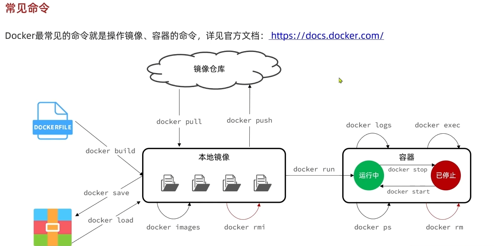
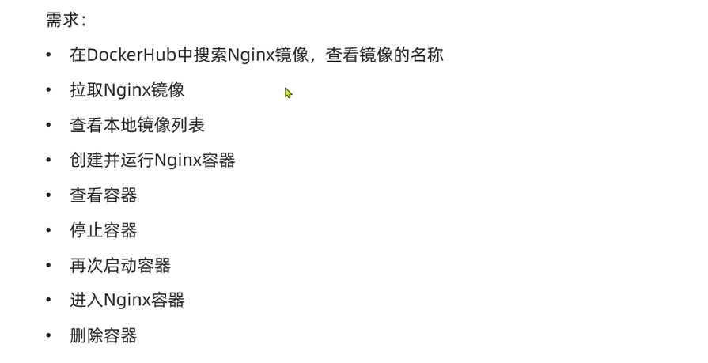

## docker简化部署
### 镜像仓库
```
hub.docker.com
```
文件资料：
```https
https://pan.baidu.com/s/1inZog6YV0f3_Qqx2WDNJag&pwd=9988
```
飞书链接：   

```https
https://b11et3un53m.feishu.cn/wiki/MWQIw4Zvhil0I5ktPHwcoqZdnec?from=from_copylink
```
密码：
```text
j.N?-+4[
```
镜像网站
```html
https://hub.docker.com/
```
启动docker
```
systemctl start docker
```
开机自启
```
systemctl enable docker
```
### docker就是相当于一个绿色免安装的包叫镜像.
包含应用本身，应用运行需要的环境，配置，系统函数库，docker运行镜像会创建一个环境，一般叫容器，
如果系统是linux，他会使用linux内核，如果系统是windows，他会创建一个微型的linux环境
## 创建镜像demo
创建并运行一个容器，容器后台运行
```commandline
docker run -d
```
给容器取名
```
--name <name>
```
端口映射:一般不能直接访问容器，docker会创建一个虚拟的端口映射，映射到宿主机的端口，这样访问宿主机的端口就可以访问到容器的端口
```
-p <host_port>:<container_port>
```
环境变量,一般在dockerhub中可以找到，
```
-e <key=value>
```
最后加上运行镜像名字，没写就是最新版本
名字：版本
所有命令用反斜杠间隔\后面不能用空格


